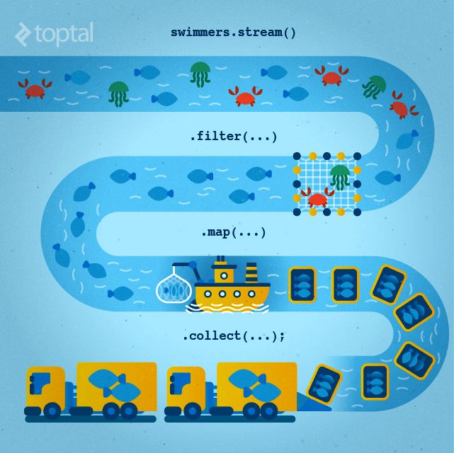
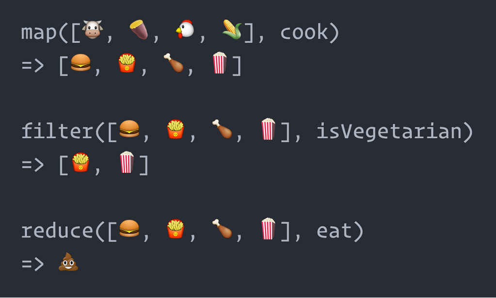

## Functional Programming

#### **NIC** Practical Programmer Series

---

### Practical Programmer Series

- Clean Code
- Code Complete
- Testable Code
- Code Reviewing
- Design Patterns
- **Functional Programming**

---

### Goals

- Understand the key concepts of FP |
- Understanding the difference between Programming Paradigms |
- Ability to transform non-functional code to functional |
- Have a FP "toolbox" to apply in a practical manner |
- Feel comfortable using FP in day-to-day scenarios |

---

### What is Functional Programming?

- The process of building software by composing **pure** functions. This means **avoiding** shared **state**, **mutable** data, and **side-effects**

```python
// imperative version
pacman = new pacman(0, 0)
while true
  if key = UP then pacman.y++
  elif key = DOWN then pacman.y--
  elif key = LEFT then pacman.x--
  elif key = RIGHT then pacman.x++
```

+++

```haskell
// functional version
let rec loop pacman =
  render(pacman)
  let x, y = switch(key)
    case UP: paxman.x, pacman.y + 1
    case DOWN: pacman.x, pacman.y - 1
    case LEFT: pacman.x - 1, pacman.y
    case RIGHT: pacman.x + 1, pacman.y
    loop(new pacman(x, y))
```

---

### Pure Functions

- A pure function **always returns the same result given the same parameters** and does not depend on the state of the system
- Only depends on the arguments passed in and doesn't modify variables out of its scope

```javascript
amount = 10;
function impureAdder(x){
  return amount + x;
}

function pureAdder(value, x){
  return value + x;
}
```

+++

```javascript
function impureCalculateTax(obj, tax){
  obj.cost *= tax;
  return obj.cost;
}

function pureCalculateTax(obj, tax){
  return obj.cost * tax;
}
```

---

### Immutable State

- An object's state **does not change** after it has been defined
- The basic strategy here is to create functions that take in a state and return a new state

```javascript
const xs = [1, 2, 3, 4, 5];

// pure
xs.slice(0, 3);
//=> [1, 2, 3]

xs.slice(0, 3);
//=> [1, 2, 3]

xs.slice(0, 3);
//=> [1, 2, 3]
```

+++

```javascript
var xs = [1, 2, 3, 4, 5];
// impure
xs.splice(0, 3);
//=> [1, 2, 3]

xs.splice(0, 3);
//=> [4, 5]

xs.splice(0, 3);
//=> []
```

Note:
- imagine using the keyword **final** for all variables
- find examples in other languages
---

### Side Effects

- A side effect is a change of system state or observable interaction with the outside world that occurs during the calculation of a result.
- printf() and similar functions are impure because it causes output to an I/O device as a side effect.

```java
Class Person{
  int age;

  public void updateAge(int age){
    this.age = age;
  }
}
```

---

### Functions As First Class Citizens

- Functions are treated the **same as any other data type** - they may be stored in arrays, passed around as function parameters, assigned to variables, etc

+++

```python
def shout(text):
    return text.upper()

def whisper(text):
    return text.lower()

def greet(func):
    # storing the function in a variable
    greeting = func("Hi")
    print greeting

print shout('Hello') //output: HELLO
yell = shout
print yell('Hello') //output: HELLO


greet(shout) //output: HI
greet(whisper) //output: hi
```

---
### Map, Filter, and Reduce

---

#### Map
- Iterate over every element and transform it in some way
- The size of the list will not change

```java
List<String> alpha = Arrays.asList("a", "b", "c", "d");
List<String> upperCase = alpha.stream()
                        .map(String::toUpperCase)
                        .collect(Collectors.toList());
System.out.println(upperCase); //[A, B, C, D]
```

---

### Filter
- Iterates over every element and only return those that satisfy the condition
- The size of the list will be equal to or less than the original list


```Python
fib = [0,1,1,2,3,5,8,13,21,34,55]
result = filter(lambda x: x % 2, fib)
#[1, 1, 3, 5, 13, 21, 55]
```


---

### Reduce
- Iterate over every element and apply the reducer while acculumulating a final value

```javascript
const euros = [29.76, 41.85, 46.5];
const sum = euros.reduce( function(total, amount){
  return total + amount
});
sum // 118.11
```

+++

```Python
def groupBy(data, key):
  def helper(acc, obj):
    category = obj.get(key)
    array = list(acc.get(category, []))
    acc[category] = array + [obj]
    return acc

  return reduce(helper, data, {})
```

---

---

### List Comprehension (Python specific)
```Python
# You can either use loops:
squares = []

for x in range(10):
    squares.append(x**2)

print squares
[0, 1, 4, 9, 16, 25, 36, 49, 64, 81]

# Or you can use list comprehensions to get the same result:
squares = [x**2 for x in range(10)]

print squares
[0, 1, 4, 9, 16, 25, 36, 49, 64, 81]
```
+++
```Python
new_range  = [i * i for i in range(5) if i % 2 == 0]
print new_range
[0, 4, 16]
```
-Simply *result*  = [transform    iteration         filter     ]

---

### Benefits of Functional Programming

- Easier to reason about pure functions
- Pure function signatures are meaningful
- Testing is easier
- Functional code keeps all state held on the stack which allows for easier debugging using the stack trace
- Easier to avoid repetitive code
- Parallel/ Concurrent programming is easier

---

### Kata

---

### Intro Solutions

```Java
//Given a list of names, change them to say "Hi <name>"
public static List<String> sayHi(List<String> names){
  return names.stream()
    .map(name -> "Hi " + name)
    .collect(Collectors.toList());
}
```

+++

```python
#Given a list of names, only return those
#longer than 5 characters
def longNames(names):
  return filter(lambda x: len(x) > 5, names)
```

+++

```Python
#Given a function and its arguments, return its result
def apply(fn, *args):
  return fn(*args)
```
---

### Advanced Topics
- FP is based on lambda calculus
- Built on three things
  - Variables
  - A way of building functions
  - A way of applying functions

<insert picture>

---

### Higher Order Functions

```python
"""
Take in a function as input and return another function as output
"""
def memoize(fn, memory):
  def helper(*args):
    if args not in memory:
      print "Need to cache"
      memory[args] = fn(*args)
    return memory[args]
  return helper
```

---

### Currying
- Currying is a way of constructing functions that allows partial application of a function’s arguments

```python
def addTwo(x, y):
  return x + y

def addCurry(x):
  def add_to(y):
    return x + y
  return add_to

print addTwo(1, 1) #2
print addCurry(1)(1) #2

addOne = addCurry(1)
print addOne(1) #2
```

---

### Pipeline
- Taking an input and transforming it through a list of operations

```python
def pipeline(data, fns):
  return reduce(lambda data, fns: map(fns, data), fns, data)

print pipeline([1,2,3],
  [lambda x: x + 1,
   lambda x: x * 100])
#[200, 300, 400]
```

+++

### Pipelining in Java

- In Java, your stream can be considered your pipeline for list operations
- A stream has operations that are Intermediate and Terminal

```java
List<String> myList =
    Arrays.asList("a1", "a2", "b1", "c2", "c1");

myList
    .stream()
    .filter(s -> s.startsWith("c")) //intermediate
    .map(String::toUpperCase)       //intermediate
    .sorted()                       //intermediate
    .forEach(System.out::println);  //terminal

// C1
// C2
```

---

### Resources

Java
- https://www.manning.com/books/java-8-in-action

Python
- https://maryrosecook.com/blog/post/a-practical-introduction-to-functional-programming

Javascript
- https://mostly-adequate.gitbooks.io/mostly-adequate-guide/
- http://reactivex.io/learnrx/

---
